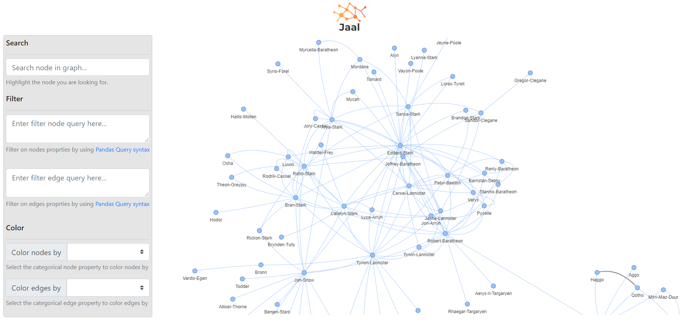
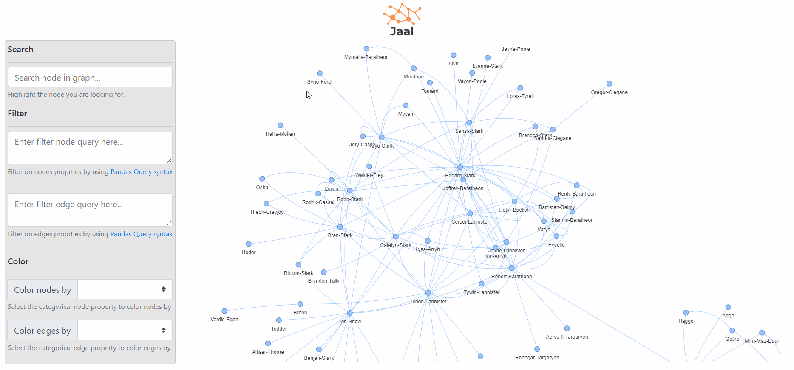
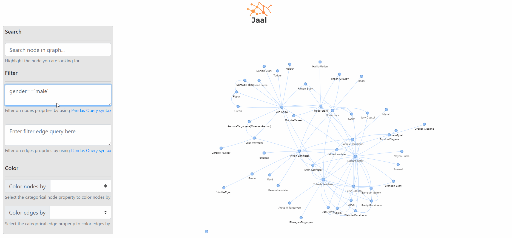
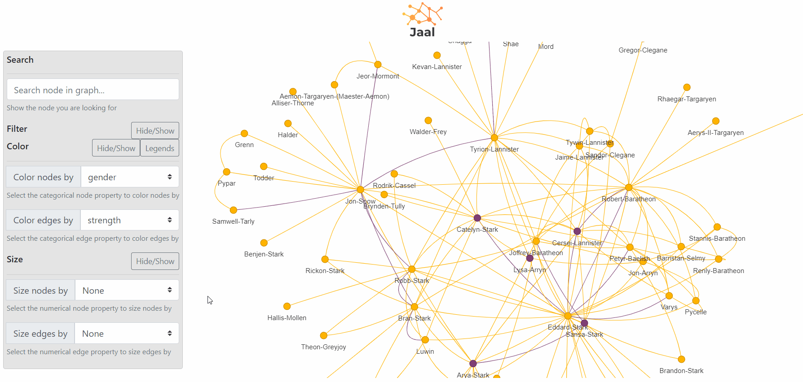

 [](https://img.shields.io/pypi/jaal) [](https://gitter.im/imm-jaal/community?utm_source=badge&utm_medium=badge&utm_campaign=pr-badge&utm_content=badge)  

*Your interactive network visualizing dashboard*

Documentation: [Here](http://mohitmayank.com/jaal/)

## 👉 What is Jaal

Jaal is a python based interactive network visualizing tool built using Dash and Visdcc. Along with the basic features, Jaal also provides multiple option to play with the network data such as searching graph, filtering and even coloring nodes and edges in the graph. And all of this within 2 lines of codes :)

## 👉 Requirements

Jaal requires following python packages, 
1. Dash
    - dash_core_components
    - dash_html_components 
2. dash_bootstrap_components
3. visdcc
4. pandas

## 👉 Install

Installing Jaal is super easy, just do the following,

```bash
pip install jaal
```

And you are done :)

Note, it's recommended to create a virtual enivornment before installing. This can be easily done using `python -m venv myenv` and then to activate the env we need,
1. (Windows) `.\\myvenv\\Scripts\\activate.bat`
2. (Linux) `source myvenv/bin/activate`

## 👉 Getting started

After installing Jaal, we need to fetch the data and call `plot` function in Jaal. This can be shown by playing with an included Game of Thrones dataset, as follows,

```python
# import
from jaal import Jaal
from jaal.datasets import load_got
# load the data
edge_df, node_df = load_got()
# init Jaal and run server
Jaal(edge_df, node_df).plot()
```

Here first we import `Jaal` main class and the dataset loading function `load_got`. Later we load the GoT dataset from the datasets included in the package. This gives us two files,
1. **edge_df:** its a pandas dataframe with atleast `from` and `to` column, which represents the edge relationship between the entities
2. **node_df:** its an optional parameter, but should contains a `id` column with unique node names. 

Note, edge_df is mandatory and node_df is optional. Also we can include additional columns in these files which are automatically considered as edge or node features respectively.

After running the plot, the console will prompt the default localhost address (`127.0.0.1:8050`) where Jaal is running. Access it to see the following dashboard,



## 👉 Features

At present, the dashboard consist of following sections,
1. **Setting panel:** here we can play with the graph data, it further contain following sections:
    - **Search:** can be used to find a node in graph
    - **Filter:** supports pandas query language and can be used to filter the graph data based on nodes or edge features.
    - **Color:** can be used to color nodes or edges based on their categorical features. Note, currently only features with at max 20 cardinality are supported. 
    - **Size:** can be used to size nodes or edges based on their numerical features.
2. **Graph:** the network graph in all its glory :)

## 👉 Examples

### 1. Searching


### 2. Filtering


### 3. Coloring


### 4. Size


## 👉 Extra settings

### Display edge label

To display labels over edges, we need to add a `label` attribute (column) in the `edge_df`. Also, it has to be in `string` format. 
For example, using the GoT dataset, by adding the following line before the `Jaal` call, we can display the edge labels.

```python
# add edge labels
edge_df.loc[:, 'label'] = edge_df.loc[:, 'weight'].astype(str)
```
### Display image in node

Currently it is possible to show image within node (with circular shape). For this, we need to put `node_image_url` column in the `node_df` with URLs for each node.


### Directed edges

By default, `Jaal` plot undirected edges. This setting can be changed by,

```python
Jaal(edge_df, node_df).plot(directed=True)
```

### Showing Tooltip

By default, `nodeid` is shown as tooltip. To overwrite this, include a `title` column with the respective data.

### Using vis.js settings

We can tweak any of the `vis.js` related network visualization settings. An example is,

```python
# init Jaal and run server
Jaal(edge_df, node_df).plot(vis_opts={'height': '600px', # change height
                                      'interaction':{'hover': True}, # turn on-off the hover 
                                      'physics':{'stabilization':{'iterations': 100}}}) # define the convergence iteration of network

```

For a complete list of settings, visit [vis.js website](https://visjs.github.io/vis-network/docs/network/).

### Using gunicorn

We can host Jaal on production level HTTP server using `gunicorn` by first creating the app file (`jaal_app.py`),

```python
# import
from jaal import Jaal
from jaal.datasets import load_got
# load the data
edge_df, node_df = load_got()
# create the app and server
app = Jaal(edge_df, node_df).create()
server = app.server
```

then from the command line, start the server by,

```
gunicorn jaal_app:server
```

Note, `Jaal.create()` takes `directed` and `vis_opts` as arguments. (same as `Jaal.plot()` except the `host` and `port` arguments)

## 👉 Common Problems

### Port related issue

If you are facing port related issue, please try the following way to run Jaal. It will try different ports, until an empty one is found.

```python
port=8050
while True:
    try:
        Jaal(edge_df, node_df).plot(port=port)
    except:
        port+=1
```

## 👉 Issue tracker

Please report any bug or feature idea using Jaal issue tracker: https://github.com/imohitmayank/jaal/issues

## 👉 Collaboration

Any type of collaboration is appreciated. It could be  testing, development, documentation and other tasks that is useful to the project. Feel free to connect with me regarding this.

## 👉 Contact

You can connect with me on [LinkedIn](https://www.linkedin.com/in/imohitmayank/) or mail me at mohitmayank1@gmail.com.

## 👉 License

Jaal is licensed under the terms of the MIT License (see the file
LICENSE).
